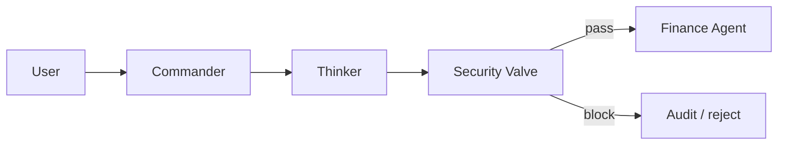

# Security Valve — agent message flow

## Layers

1. **SAR-inspired rules** — high-confidence attack patterns
2. **LLM semantic audit** — structured risk context from upstream agents

## Metrics

- **DER** — dangerous execution rate (primary security–usability metric)
- **ASR** — attack success rate
- **FRR** — false rejection rate

Reference: GlobeCom manuscript in `assets/source/GlobeCom Jiang.pdf`.
